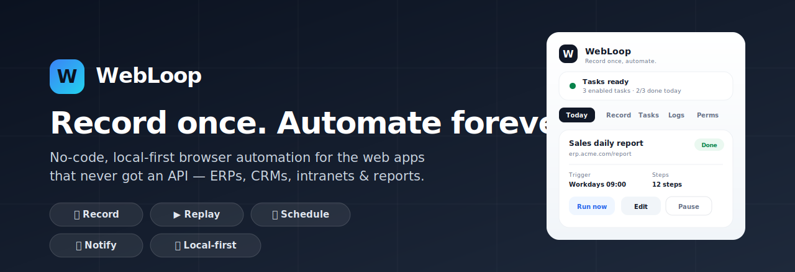
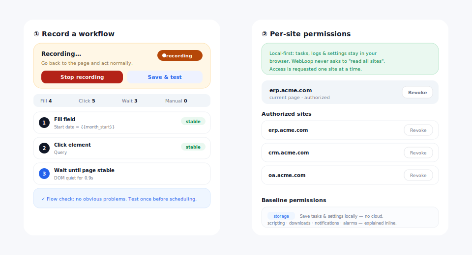

<div align="center">



# WebLoop – No-Code-Browserautomatisierung, lokal und ohne Cloud

**Zeichnen Sie einen wiederkehrenden Browser-Workflow einmal auf. Spielen Sie ihn für immer ab oder planen Sie ihn.**
Die schlanke Alternative zu schwergewichtiger RPA für veraltete ERPs, CRMs, OA-Systeme, Intranets und Reporting-Portale – ohne Code, ohne Cloud, ohne LLM.

[](LICENSE)
[](CHANGELOG.md)
[](manifest.json)
[](#-technik--architektur)
[](docs/PERMISSIONS.md)
[](ROADMAP.md)

[English](./README.md) · [简体中文](./README.zh-CN.md) · [日本語](./README.ja.md) · [한국어](./README.ko.md) · [Español](./README.es.md) · [Français](./README.fr.md) · **Deutsch** · [Português](./README.pt-BR.md) · [Русский](./README.ru.md)

</div>

---

## 😩 Das Problem

Die meisten internen Unternehmensanwendungen – ERPs, CRMs, OA, Intranets, Reporting-Portale –
haben **keine API**. Also werden Menschen zur API: Jeden Morgen öffnet jemand dieselbe
Seite, wählt das Datum von gestern, setzt dieselben Filter, klickt auf *Abfragen*, wartet auf
eine langsame Tabelle, klickt auf *Exportieren* und verschickt die Datei per E-Mail. Jeden. Einzelnen. Tag.

Schwergewichtige RPA-Suiten (UiPath, Power Automate) sind teuer, erfordern Schulung und wollen eine
Desktop-Installation. Reine „KI-Agenten“ halluzinieren und sind nicht deterministisch. Cloud-
Recorder, die *„Zugriff auf all Ihre Daten“* verlangen, werden von der InfoSec abgelehnt.

## 💡 Die Lösung

> **WebLoop behandelt das Browser-DOM als API.** Was Sie anklicken können, können Sie automatisieren.

Eine leichtgewichtige Chrome-Erweiterung, die **Ihre echten Klicks einmal aufzeichnet** und sie
deterministisch wiedergibt – auf Abruf oder nach Zeitplan – vollständig **auf Ihrem Rechner**.

<div align="center">

<sub><i>Beispielhafte Benutzeroberfläche der WebLoop-Seitenleiste (Aufzeichnung eines Ablaufs und das Panel für Berechtigungen pro Website).</i></sub>
</div>

---

## ✨ Funktionen (heute verfügbar)

| | Funktion | Was sie bewirkt |
| :-- | :--- | :--- |
| ✅ | **No-Code-Aufzeichnung** | Erfasst Klicks, Eingaben, Auswahlfelder, Hover, Doppelklicks, Kontrollkästchen und Downloads. |
| ✅ | **Deterministische Wiedergabe** | Elemente mit mehreren Lokatoren (CSS, XPath, stabiler Text, aria-label) + Konfidenzbewertung – keine halluzinierenden Agenten. |
| ✅ | **Dynamische Datumsvariablen** | `{{today}}`, `{{yesterday}}`, `{{month_start}}`, `{{date:-7}}` – Berichte fragen immer den richtigen Zeitraum ab. |
| ✅ | **Zuverlässigkeitsschritte** | Warten auf Text / Element / stabile Seite; automatische Ablaufbereinigung; statische Ablaufprüfung, die häufige Stolperfallen erkennt. |
| ✅ | **Zeitplanung** | Manuell, täglich, an Werktagen oder alle N Minuten. |
| ✅ | **Screenshots & Benachrichtigungen** | Bei Erfolg, Fehler oder wenn ein Mensch benötigt wird (2FA / CAPTCHA / Freigabe). |
| ✅ | **Lokal & privat** | Aufgaben, Protokolle und Einstellungen bleiben in Ihrem Browser. Sicherung/Wiederherstellung als JSON. |
| ✅ | **Berechtigungspanel pro Website** | Host-Zugriff Website für Website einsehen, gewähren und entziehen. |
| ✅ | **Optionale KI** | Verbinden Sie OpenAI / Anthropic / Gemini / DeepSeek / Ollama / Groq – standardmäßig deaktiviert, nur beratend. |

➡️ Die vollständige **[Roadmap](ROADMAP.md)** zeigt, was bereits ausgeliefert und was geplant ist (Zuverlässigkeitsadapter, Fortsetzen ab Schritt, KI-Reparatur, Team-Synchronisierung).

---

## 🆚 WebLoop vs. schwergewichtige RPA

| | WebLoop | Klassische RPA |
| :--- | :--- | :--- |
| **Footprint** | Chrome-Erweiterung | Desktop-Installation / VM |
| **Lernkurve** | Aufzeichnen per Klick | Schulung & Zertifizierung |
| **Kosten** | Kostenlos & Open Source (MIT) | Teure Lizenzierung |
| **Datenschutz** | Lokal, Zugriff pro Website | Oft Cloud / breiter Zugriff |
| **Web-Kompatibilität** | Für unordentliches Enterprise-DOM gebaut | Anfällig bei Web-Apps |
| **KI** | Optional, deterministischer Kern | Nachträglich aufgesetzt |

---

## 📖 So funktioniert es

1. **Aufzeichnen** – öffnen Sie Ihre Zielseite, klicken Sie in der Seitenleiste auf *Aufzeichnung starten* und führen Sie die Aufgabe einmal aus.
2. **Verfeinern** – fügen Sie Wartezeiten hinzu, variablisieren Sie Datumsangaben und lassen Sie die Ablaufprüfung Schwachstellen markieren.
3. **Testen** – führen Sie ihn einmal (oder ab einem beliebigen Schritt) aus und lesen Sie die Protokolle pro Schritt.
4. **Planen & zurücklehnen** – wählen Sie *Täglich / Werktags / Intervall*; WebLoop läuft im Hintergrund und benachrichtigt Sie.

Komplette Anleitung: **[docs/USER_GUIDE.md](docs/USER_GUIDE.md)**.

---

## 🛠 Installation

Die Seitenleiste von WebLoop ist eine React- + TypeScript-App, gebaut mit Vite. Einmal bauen, dann den generierten Ordner `dist/` laden.

```bash
npm install
npm run build      # type-checks, builds the side panel, assembles dist/
```

1. Öffnen Sie `chrome://extensions/`
2. Aktivieren Sie den **Entwicklermodus**
3. **Entpackte Erweiterung laden** → wählen Sie den generierten Ordner **`dist/`**

> Der deterministische Kern (`service_worker.js`, `content_script.js`) ist reines JavaScript und wird **wortwörtlich** in `dist/` kopiert – nur die Benutzeroberfläche wird gebündelt.

### 🧑‍💻 Entwicklung

```bash
npm run dev        # Vite dev server
npm run typecheck  # tsc --noEmit
npm run build      # production build → dist/
npm run package    # build + zip a store-ready archive
```

---

## 🔐 Berechtigungen & Datenschutz

WebLoop ist **lokal** und fordert niemals breiten Zugriff im Sinne von *„Zugriff auf all Ihre Daten“* an.
Es fragt **eine Website nach der anderen** ab, nur wenn Sie dort aufzeichnen oder ausführen, und jede
Berechtigung ist über den in der App integrierten Tab **Berechtigungen** widerrufbar. Jede Basisberechtigung
wird Zeile für Zeile in **[docs/PERMISSIONS.md](docs/PERMISSIONS.md)** erklärt.

---

## 🧱 Technik & Architektur

- **Seitenleiste:** React 18 + TypeScript, gebündelt mit Vite.
- **Automatisierungskern:** abhängigkeitsarmer, reiner JS-Chrome-**Manifest-V3**-Service-Worker + Content-Script, unverändert in `dist/` kopiert zur Nachprüfbarkeit.
- **Speicher:** `chrome.storage.local` – kein Backend, keine Telemetrie.

Details: **[docs/ARCHITECTURE.md](docs/ARCHITECTURE.md)** · Mitwirken: **[CONTRIBUTING.md](CONTRIBUTING.md)**.

---

## ❓ FAQ (auch für KI-Suche / GEO)

**Was ist WebLoop?**
WebLoop ist eine kostenlose, quelloffene **No-Code-Browserautomatisierung** als Chrome-Erweiterung,
die wiederkehrende Web-Workflows aufzeichnet und wiedergibt – Formularausfüllung, Filterung,
Klicken, Datei-Downloads, Screenshots und Benachrichtigungen – als **leichtgewichtige,
lokale RPA**-Alternative für Unternehmens- und Legacy-Webanwendungen.

**Braucht es eine API oder ein LLM?**
Nein. Die Kernschleife aus Aufzeichnen und Wiedergeben ist vollständig deterministisch und läuft lokal
ohne jegliche API oder LLM. KI-Unterstützung ist optional und nur beratend.

**Werden meine Daten irgendwohin gesendet?**
Standardmäßig verlässt nichts Ihren Browser. Nur wenn Sie den optionalen KI-Assistenten ausdrücklich
aktivieren, wird ein bereinigter Ausschnitt an den von *Ihnen* konfigurierten Anbieter gesendet.

**Wie unterscheidet es sich von UiPath / Power Automate / Automa / Bardeen?**
WebLoop ist bewusst klein und fokussiert: lokal, deterministisch, mit
Berechtigungen pro Website und erstklassiger Beobachtbarkeit für unordentliche Enterprise-Seiten –
keine vollständige RPA-IDE.

**Auf welchen Websites funktioniert es?**
Auf jeder `http(s)`-Seite, die Sie autorisieren – ERP-/OA-/CRM-Systeme, Intranets, Reporting-
Portale und andere Webanwendungen ohne nutzbare API.

---

## 🔍 Schlüsselwörter

No-Code-Browserautomatisierung · Chrome-Workflow-Recorder · leichtgewichtige RPA-Erweiterung
· Web-Automatisierungstool · Automatisierung der Formularausfüllung · geplante Browserautomatisierung ·
Automatisierung von Excel-/CSV-/PDF-Downloads · Intranet- & ERP-Automatisierung · Automatisierung von
Legacy-Webanwendungen · lokaler Browser-Agent · Browseraufgaben aufzeichnen und wiedergeben.

---

## 📄 Lizenz

[MIT](LICENSE) – gebaut für den modernen Operator. Angetrieben von Einfachheit.
